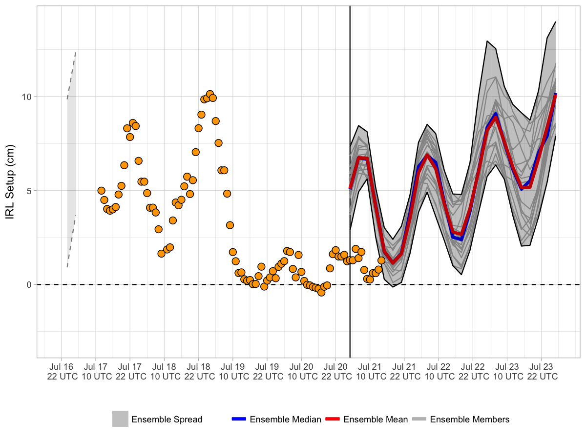

## Current Forecast
Valid 2017-05-02 20:45:52 EDT

Operational, ensemble-based, probabilistic wave setup forecasting for the [Indian River Lagoon (IRL)](https://en.wikipedia.org/wiki/Indian_River_Lagoon).

## About the IRL
The IRL is a coastal estuary that separates east-central Florida's barrier islands from the mainland. It is [rich in biodiversity](http://www.sms.si.edu/irlspec/maps.htm) and provides recreation for millions of people each year. The surrounding land represents [billions of dollars of real estate value](http://www.floridatoday.com/story/news/local/environment/lagoon/2016/07/29/why-healthy-lagoon-worth-63-billion-local-economy/87651436/) and is home to campuses of many high-tech enterprises, including NASA's [Kennedy Space Center](https://www.kennedyspacecenter.com/).

Currently the IRL is in a state of peril. Nutrient runoff, among other factors, has led to harmful [algal blooms](http://fcir.org/2016/08/06/floridas-indian-river-lagoon-in-environmental-crisis/), [fish kills](http://www.cnn.com/2016/03/25/us/florida-fish-kill/), and other crises that have received national attention. A current project aimed at cleaning the IRL was just featured on NPR's [All Things Considered](http://www.npr.org/2017/04/27/525918318/florida-battles-with-tricky-removal-of-costly-muck-in-indian-river-lagoon).

## IRL Research
Understanding the IRL and its current deteriorating state is an area of active research. Many research institutions and nonprofits are engaged in understanding the IRL and its deteriorating state, and investigating sustainable solutions for restoring the IRL's health. These include the [Florida Institute of Technology](http://www.fit.edu/indian-river-lagoon/), [Florida Atlantic University](http://www.fau.edu/hboi/focus_indian_river_lagoon.php), the [University of Central Florida](http://today.ucf.edu/topic/indian-river-lagoon/), and the [Marine Resources Council](http://www.savetheirl.org/), among *many* others.

## This work
At the Florida Institute of Technology, Meteorology Professor Dr. Steven Lazarus and Ocean Engineering Professor Dr. Robert Weaver received a [NOAA grant](https://newsroom.fit.edu/2014/02/27/faculty-members-earn-453000-noaa-grant-to-improve-model-simulations-for-bodies-of-water-including-indian-river-lagoon/) to study the effects of high-impact meteorological events (e.g., hurricanes and mid-latitude cylones) on the IRL's wave and circulation properties. As part of this research, Ph. D. candidate Jeff Colvin developed a regression-based approach to forecasting the difference in water elevation between two locations in the IRL. Fellow Ph. D. candidate Bryan Holman used his knowledge of operational ensemble systems and extended Jeff's approach to provide probabilistic real-time forecasts of the elevation change between these two points. This repository houses the code that creates these forecasts.

The operational forecasts this project creates are viewable at [irlsetup.github.io](https://irlsetup.github.io). More information about these forecasts can be found at [irlsetup.github.io/about](https://irlsetup.github.io/about).

## Contact
This project is operated and maintained by [Bryan Holman](https://github.com/bhlmn). The best way to contact him is by email: [bholman2013 (at) my (dot) fit (dot) edu](mailto:bholman2013@my.fit.edu).
